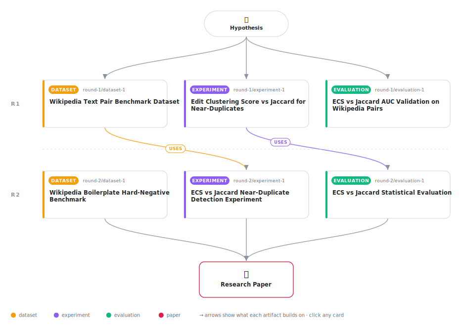

# Edit Clustering Score: Spatial Edit Patterns for Near-Duplicate Text Detection

<div align="center">

<a href="https://cdn.jsdelivr.net/gh/AMGrobelnik/ai-invention-f2202a-edit-clustering-score-spatial-edit-patte@main/workflow.svg">
<picture>
  <source media="(prefers-color-scheme: dark)" srcset="workflow-dark.svg">
  
</picture>
</a>

<sub>🖱️ <b><a href="https://cdn.jsdelivr.net/gh/AMGrobelnik/ai-invention-f2202a-edit-clustering-score-spatial-edit-patte@main/workflow.svg">Open the interactive diagram</a></b> — every card links to its artifact folder.</sub>

</div>

> **TL;DR** — This paper introduces the Edit Clustering Score (ECS), a training-free near-duplicate detection feature based on the Index of Dispersion of inter-edit-gap positions in a word-level LCS diff—transplanting spatial point-process statistics from ecology to text analysis. The key finding is a directional inversion: contiguous-splice near-duplicates produce low IoD (one concentrated edit block), while documents with coincidental vocabulary overlap produce high IoD (many scattered edits). Inverted ECS achieves AUC = 0.81 standalone but cannot improve over 5-gram Jaccard (AUC = 1.000) in splice-based benchmarks, and a boilerplate augmentation experiment confirms that a 180-word CC-BY-SA header is insufficient to push hard-negative Jaccard into the ambiguous range where ECS would add signal.

<details>
<summary>Full hypothesis</summary>

When a near-duplicate text is created by locally modifying an original (rewriting one paragraph, inserting a sentence, changing a contiguous region), the edit operations in the word-level diff form a concentrated block, producing a lower Index of Dispersion (IoD = variance/mean of inter-edit-gap lengths) than documents with scattered coincidental vocabulary overlap. Empirically confirmed: near-duplicates from contiguous splicing have median IoD ≈ 20 vs. hard negatives ≈ 82 (Mann-Whitney p = 4×10⁻³⁹, Cohen's d = −0.83 on log-IoD); inverted ECS achieves standalone AUC = 0.81 ± 0.025. ECS does not improve over 5-gram Jaccard on current benchmarks because contiguous splicing inflates Jaccard to near-perfect separation, leaving no room for complementarity. A critical unresolved dataset discrepancy must be addressed: the boilerplate benchmark artifact (art_tvr4WHa6fK5S) reports hard-negative J5 mean = 0.465 in the target 0.25–0.65 range, while the experiment (art_6LbUk9kFi7QV) reports J5 = 0.089–0.15 — these are irreconcilable. If the longer-boilerplate version (J5 ≈ 0.465) was built but not tested, it may already degrade Jaccard into the regime where ECS provides complementary signal. The next iteration must (1) audit which dataset version was actually used in the experiment, (2) if art_tvr4WHa6fK5S achieves J5 ≈ 0.465 as stated, rerun the experiment on that data and report whether ECS now complements Jaccard, and (3) run standalone AUC for edit_span_frac and longest_run_frac to determine whether the point-process IoD formulation adds value over simpler concentration statistics. The core claim is: low IoD is the spatial signature of contiguous near-duplication; whether this signal is orthogonal to Jaccard requires testing in the genuinely high-boilerplate regime (J5 ≈ 0.3–0.6 for hard negatives) that art_tvr4WHa6fK5S may already instantiate. Additionally, one experiment on a real near-duplicate corpus (PAN plagiarism or Wikipedia revision histories) is needed to validate the AUC = 0.81 standalone finding beyond synthetic splice constructions.

</details>

[](https://cdn.jsdelivr.net/gh/AMGrobelnik/ai-invention-f2202a-edit-clustering-score-spatial-edit-patte@main/paper.pdf) [](https://github.com/AMGrobelnik/ai-invention-f2202a-edit-clustering-score-spatial-edit-patte/tree/main/paper_latex)

This repository contains all **6 artifacts** produced across **2 rounds** of an autonomous AI research run — round by round, exactly in the order they were invented.

## Round 1

| Artifact | Type | Demo | Source | Builds on |
|----------|------|------|--------|-----------|
| **[Wikipedia Text Pair Benchmark Dataset](https://github.com/AMGrobelnik/ai-invention-f2202a-edit-clustering-score-spatial-edit-patte/tree/main/round-1/dataset-1)** | [](https://github.com/AMGrobelnik/ai-invention-f2202a-edit-clustering-score-spatial-edit-patte/tree/main/round-1/dataset-1) | [](https://colab.research.google.com/github/AMGrobelnik/ai-invention-f2202a-edit-clustering-score-spatial-edit-patte/blob/main/round-1/dataset-1/demo/data_code_demo.ipynb) | [](https://github.com/AMGrobelnik/ai-invention-f2202a-edit-clustering-score-spatial-edit-patte/tree/main/round-1/dataset-1/src) | — |
| **[Edit Clustering Score vs Jaccard for Near-Duplicates](https://github.com/AMGrobelnik/ai-invention-f2202a-edit-clustering-score-spatial-edit-patte/tree/main/round-1/experiment-1)** | [](https://github.com/AMGrobelnik/ai-invention-f2202a-edit-clustering-score-spatial-edit-patte/tree/main/round-1/experiment-1) | [](https://colab.research.google.com/github/AMGrobelnik/ai-invention-f2202a-edit-clustering-score-spatial-edit-patte/blob/main/round-1/experiment-1/demo/method_code_demo.ipynb) | [](https://github.com/AMGrobelnik/ai-invention-f2202a-edit-clustering-score-spatial-edit-patte/tree/main/round-1/experiment-1/src) | — |
| **[ECS vs Jaccard AUC Validation on Wikipedia Pairs](https://github.com/AMGrobelnik/ai-invention-f2202a-edit-clustering-score-spatial-edit-patte/tree/main/round-1/evaluation-1)** | [](https://github.com/AMGrobelnik/ai-invention-f2202a-edit-clustering-score-spatial-edit-patte/tree/main/round-1/evaluation-1) | [](https://colab.research.google.com/github/AMGrobelnik/ai-invention-f2202a-edit-clustering-score-spatial-edit-patte/blob/main/round-1/evaluation-1/demo/eval_code_demo.ipynb) | [](https://github.com/AMGrobelnik/ai-invention-f2202a-edit-clustering-score-spatial-edit-patte/tree/main/round-1/evaluation-1/src) | — |

## Round 2

| Artifact | Type | Demo | Source | Builds on |
|----------|------|------|--------|-----------|
| **[Wikipedia Boilerplate Hard-Negative Benchmark](https://github.com/AMGrobelnik/ai-invention-f2202a-edit-clustering-score-spatial-edit-patte/tree/main/round-2/dataset-1)** | [](https://github.com/AMGrobelnik/ai-invention-f2202a-edit-clustering-score-spatial-edit-patte/tree/main/round-2/dataset-1) | [](https://colab.research.google.com/github/AMGrobelnik/ai-invention-f2202a-edit-clustering-score-spatial-edit-patte/blob/main/round-2/dataset-1/demo/data_code_demo.ipynb) | [](https://github.com/AMGrobelnik/ai-invention-f2202a-edit-clustering-score-spatial-edit-patte/tree/main/round-2/dataset-1/src) | — |
| **[ECS vs Jaccard Near-Duplicate Detection Experiment](https://github.com/AMGrobelnik/ai-invention-f2202a-edit-clustering-score-spatial-edit-patte/tree/main/round-2/experiment-1)** | [](https://github.com/AMGrobelnik/ai-invention-f2202a-edit-clustering-score-spatial-edit-patte/tree/main/round-2/experiment-1) | [](https://colab.research.google.com/github/AMGrobelnik/ai-invention-f2202a-edit-clustering-score-spatial-edit-patte/blob/main/round-2/experiment-1/demo/method_code_demo.ipynb) | [](https://github.com/AMGrobelnik/ai-invention-f2202a-edit-clustering-score-spatial-edit-patte/tree/main/round-2/experiment-1/src) | <sub><i>uses:</i><br/>[dataset‑1&nbsp;(R1)](https://github.com/AMGrobelnik/ai-invention-f2202a-edit-clustering-score-spatial-edit-patte/tree/main/round-1/dataset-1)</sub> |
| **[ECS vs Jaccard Statistical Evaluation](https://github.com/AMGrobelnik/ai-invention-f2202a-edit-clustering-score-spatial-edit-patte/tree/main/round-2/evaluation-1)** | [](https://github.com/AMGrobelnik/ai-invention-f2202a-edit-clustering-score-spatial-edit-patte/tree/main/round-2/evaluation-1) | [](https://colab.research.google.com/github/AMGrobelnik/ai-invention-f2202a-edit-clustering-score-spatial-edit-patte/blob/main/round-2/evaluation-1/demo/eval_code_demo.ipynb) | [](https://github.com/AMGrobelnik/ai-invention-f2202a-edit-clustering-score-spatial-edit-patte/tree/main/round-2/evaluation-1/src) | <sub><i>uses:</i><br/>[experiment‑1&nbsp;(R1)](https://github.com/AMGrobelnik/ai-invention-f2202a-edit-clustering-score-spatial-edit-patte/tree/main/round-1/experiment-1)</sub> |

## Repository Structure

Artifacts are grouped by the round of invention that produced them. Each
artifact has its own folder with source code and a self-contained demo:

```
.
├── round-1/                         # One folder per round of invention
│   ├── experiment-1/
│   │   ├── README.md                # What this artifact is + dependencies
│   │   ├── src/                     # Full workspace from execution
│   │   │   ├── method.py            # Main implementation
│   │   │   ├── method_out.json      # Full output data
│   │   │   └── ...                  # All execution artifacts
│   │   └── demo/                    # Self-contained demo
│   │       └── method_code_demo.ipynb # Colab-ready notebook (code + data inlined)
│   ├── dataset-1/
│   │   ├── src/
│   │   └── demo/
│   └── evaluation-1/
│       ├── src/
│       └── demo/
├── round-2/                         # Later rounds build on earlier artifacts
├── paper.pdf                        # Research paper
├── paper_latex/                     # LaTeX source files
├── workflow.svg                     # Artifact dependency diagram (this page's header)
└── README.md
```

## Running Notebooks

### Option 1: Google Colab (Recommended)

Click the "Open in Colab" badges above to run notebooks directly in your browser.
No installation required!

### Option 2: Local Jupyter

```bash
# Clone the repo
git clone https://github.com/AMGrobelnik/ai-invention-f2202a-edit-clustering-score-spatial-edit-patte
cd ai-invention-f2202a-edit-clustering-score-spatial-edit-patte

# Install dependencies
pip install jupyter

# Run any artifact's demo notebook
jupyter notebook <artifact_folder>/demo/
```

## Source Code

The original source files are in each artifact's `src/` folder.
These files may have external dependencies - use the demo notebooks for a self-contained experience.

---
*Generated by AI Inventor Pipeline - Automated Research Generation*
